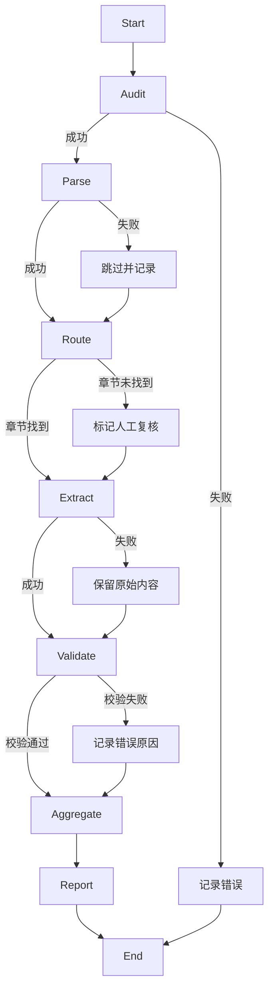

# Workflow Graph



## 工作流节点详细说明

### 1. Audit（审核）
- 检查metadata.csv是否存在
- 验证PDF文件是否存在
- 检查重复和相关性
- **输出**: 216个有效PDF文件

### 2. Parse（解析）
- 使用MinerU API解析PDF（主要方法）
- 使用pdfminer.six作为备用方案
- 使用PaddleOCR处理扫描版PDF
- **输出**: 216个Markdown文件（100%成功）

### 3. Route（路由）
- 根据关键词定位目标章节（每个议题20个关键词）
- 支持6种目录格式匹配
- 启用模糊匹配作为兜底
- **输出**: 1263个章节定位（97.5%成功率）

### 4. Extract（抽取）
- 调用LLM抽取字段（每个议题5个字段）
- 保存抽取结果和证据文本
- **输出**: 56835条字段记录

### 5. Validate（校验）
- 使用Pydantic校验结果
- 记录校验错误类型
- **输出**: 216条有效记录

### 6. Aggregate（聚合）
- 汇总为结构化表格
- 生成跨银行对比分析
- 生成时间序列分析
- **输出**: 汇总分析报告

### 7. Report（报告）
- 生成最终汇总报告
- 输出展示材料
- **输出**: summary_report.md及相关报告

## 项目统计概览

```
┌─────────────────────────────────────────────────────────────┐
│  项目统计概览 (2026-06-14)                                 │
├─────────────────────────────────────────────────────────────┤
│  银行数量: 42 家                                           │
│  PDF文档: 216 份                                           │
│  时间范围: 2021-2025                                       │
│  提取字段: 45 个/文档                                      │
│  总记录数: 56,835 条                                       │
├─────────────────────────────────────────────────────────────┤
│  ✅ PDF解析: 100% (216/216)                               │
│  ✅ OCR处理: 100% (12/12 扫描版)                           │
│  ✅ 章节定位: 97.5% (1263/1296)                           │
│  ✅ 高置信度: 86.7% (1095/1263)                           │
└─────────────────────────────────────────────────────────────┘
```

## 工作流模式说明

| 模式 | 说明 | 应用场景 |
|------|------|----------|
| **顺序流水线** | 按顺序执行各节点 | 标准处理流程 |
| **条件分支** | 根据结果选择路径 | 章节定位失败时进入人工复核 |
| **失败重试** | 不稳定节点重试 | MinerU API 超时处理 |
| **Human-in-the-loop** | 人工确认环节 | Route步骤后人工抽查 |

## 六个核心议题

1. **风险管理** - 风险控制、信用风险、市场风险、全面风险管理
2. **公司治理** - 董事会、监事会、内部控制、三会一层
3. **绿色金融** - ESG、双碳、碳中和、绿色信贷
4. **消费者权益保护** - 客户保护、信息安全、投诉处理
5. **普惠金融** - 小微企业、三农、农村金融
6. **乡村振兴** - 农村金融、涉农贷款、乡村发展